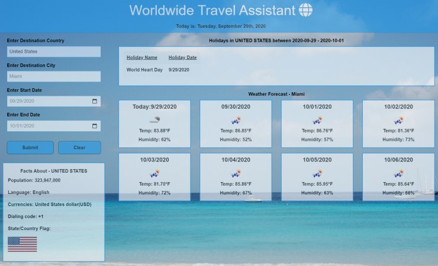

# Project 1  
___
## Title: Worldwide Weather Assistant
Team members:   
- Mongolmaa Gurbazar  
- Nigara Sawirdin  
- Sean Akene  
- Yigezu Birhane  
- Ed Sivick  
___
## Requirements
01 Must use at least two server-side APIs  
02 Must use a CSS framework other than Bootstrap  
03 Use at least one new third-party API  
04 Must have a polished, mobile-first UI  
05 Must meet good quality coding standards (indentation, scoping, naming, etc.)  
06 Does NOT use alerts, confirms, or prompts (look into modals).  
07 Must be deployed to GitHub Pages  
08 Must be interactive (i.e: accept and respond to user input)  
___
## User Story
AS a worldwide business and leisure traveler who plans trips ranging from 1 day to 2 weeks  
I want to know the holidays, weather, and some useful information about the area that I am visiting  
WHEN I am presented with this information, I can determine the proper clothing to wear, and the areas that might have holiday-related activities  
___
## Project Description
Business and leisure travel to many states or countries can be difficult if you aren’t equipped with the proper attire, or knowledge of specific holidays in that area. The ability to view this information before visiting the region can save the traveler time and effort through pre-planning.  The travel input criteria including: visiting city, start travel date, and end travel date will initialize a server-side API from https://calendarific.com/, providing them with holiday information as well as useful facts about their destination.  Information pertaining to the destination country is supplied to the app by means of an API from RESTful, https://restcountries.eu/#rest-countries. The traveler can also utilize the weather information for that destination, and select the proper clothing or make appropriate plans to adjust for it.  The input data is used to initiate another server-side API from https://openweathermap.org/ to provide the weather information.  The date information is displayed using **moment.js**
___
## Layout: index.html
The index.html file was built using ZURB Foundation, a responsive front-end framework that is similar to Bootstrap.  The app utilizes a foundation callout in a header that identifies the title of the app along with a paragraph element that displays the current date from **moment.js**. The grid for the app was completed using a left and a right side column.  The left side column contains a row div wrapping a column div, **columns large-3 small-12 medium-3**.  This allows for a single column display (**small-12**) on smaller mobile devices.  The top portion of this column contains a form with several interactive user inputs for traveling to their desired destination, **Destination Country**, **Destination City**, **Start Date**, and **End Date**. The user then presses the **Submit** button to initiate the JavaScript code, and display the associated API responses.  These responses include the data that is shown  inside the **Country information** div, **Destination Holidays** table, and **Weather Forecast** cards. 

The right side column containing the Destination Holidays, and Weather Forecast data is built using a column layout **columns large-9 small-12 medium-9**. The daily weather forecast is represented by separate dynamically created Foundation cards through JavaScript and have a column layout of **columns large-3 medium-6 small-12** for each card. This layout again allows for a single column display (**small-12**) on smaller mobile devices. A sticky footer was added to the bottom of the app to display the title and Copyright year. An empty div was added below the left and right side columns to allow space between the displayed data and the top of the footer for smaller mobile devices.  
___
## Layout: style.css

The style.css file is initiated by setting box-sixing to border-box with padding and margin set to 0. The default styling for the Foundation callout showing the title at the top of the app is overridden to add custom style for the header. Color variations were kept to a minimum with all text displayed as black or white, with all app colors closely matching the cropped background image of a Barbados beach photograph (thanks to Nancy from Dallas for the image).  All additional styling, including borders and background color for the **Country Information**, **Destination Holidays**, daily **Weather Forecast** cards, and footer reflect this color scheme. The opacity values for all content on the app were adjusted to allow semi-transparency.
___
## Layout: script.js
The script.js file primarily utilizes 3 functions when the Submit button on the app is pressed. The **function coutryflag(countrycode)** sends a queryURL request to https://restcountries.eu/#rest-countries and runs the returned response inside the **.then function()**. The response object of data is then evaluated to display the country information to the app including: Population, Language, Currencies, Dialing Code, and the image of the country flag.  
The function **calendricapi(arguments)** sends a queryURL request to https://calendarific.com/ and runs the returned response inside the **.then function()**. The response object of data is then evaluated to display the Destination Holidays for the country that fall within the **Start Date** and **End Date** input fields.  This information is displayed on the app in a table under the headings: **Holiday Name**, and **Holiday Date**.  
The function **weatherforcastapi(lat, lon)** sends a queryURL request to https://openweathermap.org/ and runs the returned response inside the **.then function()**. The response object of data is then evaluated to display the current weather, and weather forecast for the city identified in the **Enter Destination City** input field.  This information is displayed on the app in the **Weather Forecast**  cards displaying the **Temperature**, and **Humidity**.  
The **location.reload()** function is initiated when the user clicks on the app **Clear** button.  This will remove all displayed data and re-load the app.
___
## Summary
 Useful destination information plays an important role in the planning for any business or leisure traveler.  It is always beneficial to have more information. This information can be helpful in the following ways:
 - bringing the correct language translation tools
 - whether to visit or avoid certain locations based on holiday information 
 - checking the currency exchange rates prior to traveling
 -  being aware of the correct dialing code to use
 - having knowledge of the country population and honored flag
 - preparing for current or future weather conditions in selecting the proper clothing to wear, outdoor activities to attend, or vehicle to rent  

## Application Links and Images  
**Links:**  
Application link: (https://yigezu1.github.io/world-wide-travel-assistant/)  
index.html code: (https://github.com/Yigezu1/world-wide-travel-assistant/blob/master/index.html)  
style.css code: (https://github.com/Yigezu1/world-wide-travel-assistant/blob/master/assets/css/style.css)  
script.js code: (https://github.com/Yigezu1/world-wide-travel-assistant/blob/master/assets/js/script.js)  

  